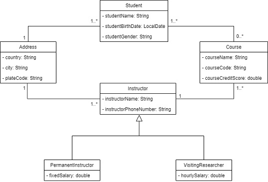
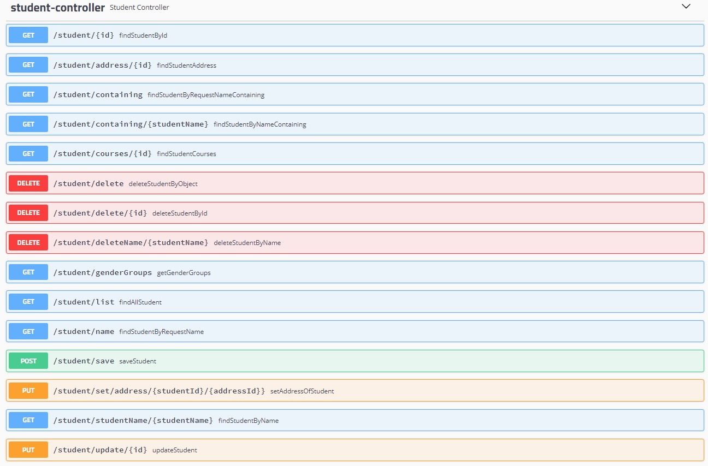
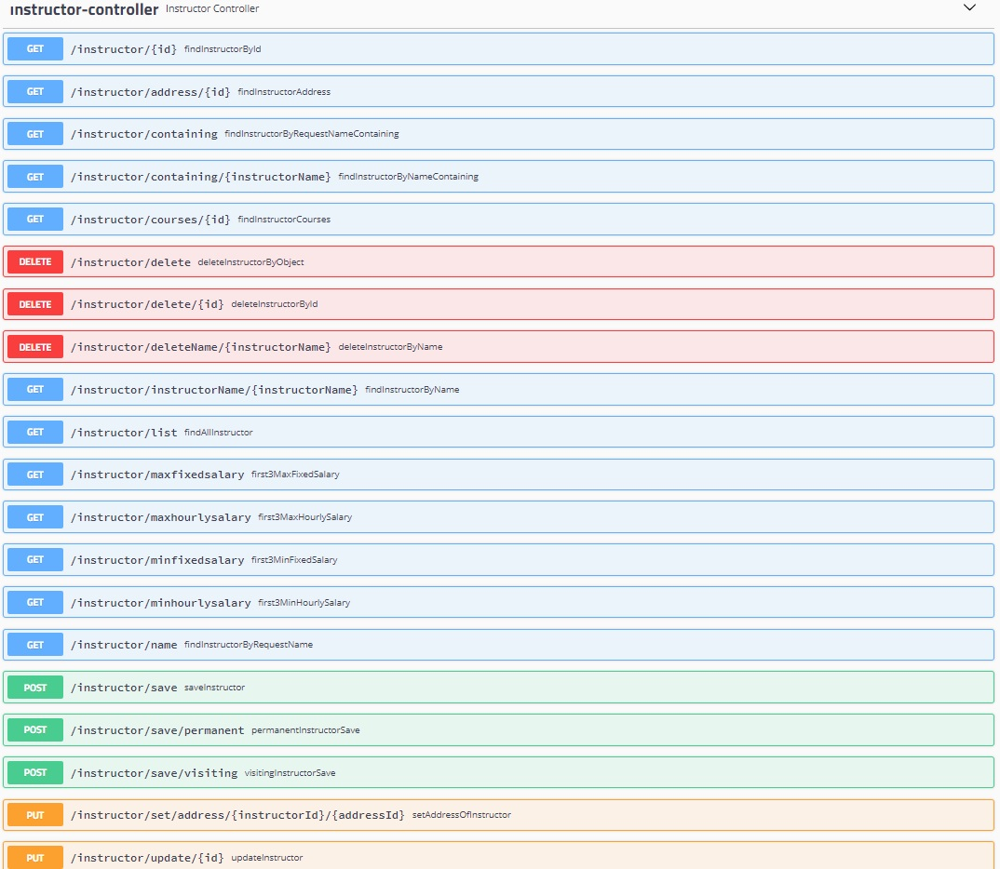
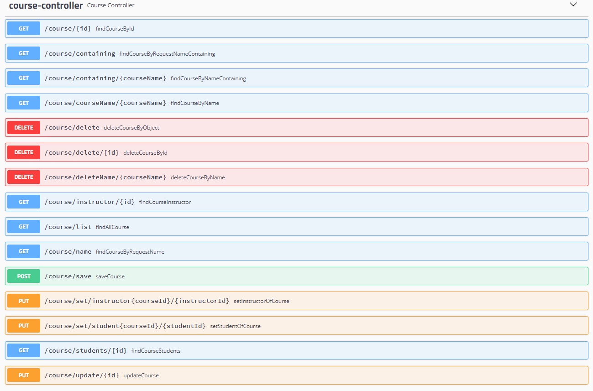
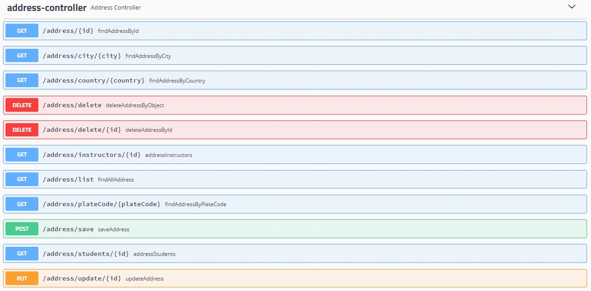
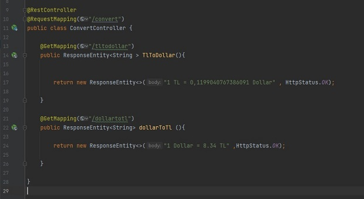
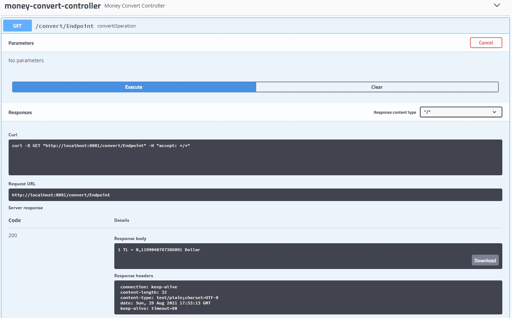
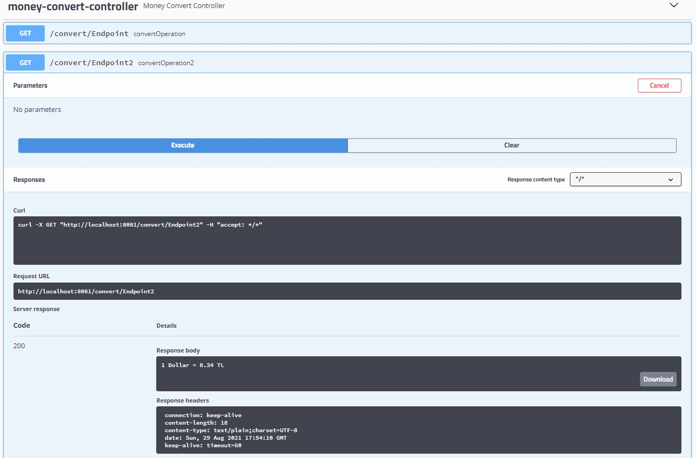

## Description

---
- The third project of Gitti Gidiyor Java Spring Bootcamp by patika.
- Database of a school management system has been created.
- H2 is used as the database system.
- The connection of the project with h2 is made using Spring Data Jpa.
- Querying, updating and deleting operations can be performed With Spring Boot Get, Post, Put and Delete mapping.
- The design of the project was made in accordance with the UML diagram.
- Swagger was used to perform Get, Post, Put and Delete mapping operations.

## School Management System UML Diagram

---

## Mapping Operations on Swagger

---
### Mapping Operations On The Student

### Mapping Operations On The Instructor

### Mapping Operations On The Course

### Mapping Operations On The Address

## Accessing Another Endpoint Using RestTemplate

---
### Accessed Endpoints

* Accessed Urls:
  * "http://localhost:8080/convert/tltodollar"
  * "http://localhost:8080/convert/dollartotl"

### Accessor Endpoint for TlToDollar Operation

* Accessor Url:
  * "http://localhost:8081/convert/Endpoint"

### Accessor Endpoint for DollarToTl Operation

* Accessor Url:
  * "http://localhost:8081/convert/Endpoint2"

## Third Project

